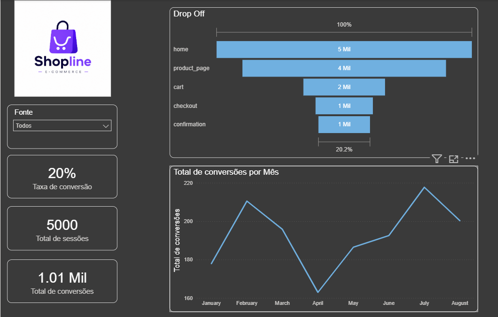

# Customer Journey Funnel Analysis

Dashboard de análise de funil para e-commerce, construído sobre um pipeline completo de dados com arquitetura medallion e star schema.

---

## Visão Geral

Este projeto analisa o comportamento de usuários ao longo de um funil de compra com 5 etapas — da home até a confirmação de pedido —, identificando onde ocorrem os maiores abandonos e como a taxa de conversão se comporta ao longo do tempo.



**Principais resultados identificados:**
- Taxa de conversão geral de **20%** sobre 5.000 sessões
- Maior drop-off entre `product_page` e `cart` (~50% de abandono nessa transição)
- Sazonalidade de conversão com queda expressiva em abril e pico em julho

---

## Stack Técnica

| Camada | Tecnologia |
|---|---|
| Ingestão e transformação | Python (pandas) · Google Colab |
| Armazenamento intermediário | CSV |
| Modelagem analítica | Python (pandas) |
| Visualização | Power BI Desktop |

---

## Arquitetura do Pipeline

O projeto segue a **arquitetura medallion** (Bronze → Silver → Gold):

```
Raw     →  dados brutos da fonte original
Silver  →  limpeza, tipagem, colunas derivadas (funnel_order, flags)
Gold    →  star schema pronto para consumo analítico
```

### Star Schema (camada Gold)

```
                   ┌─────────────┐
                   │  fact_table │
                   └──────┬──────┘
                          │ 
         ┌────────────────┼────────────────┐
         │SessionKey      │DateID          │PageID
 ┌───────┴──────┐  ┌──────┴────────┐   ┌───┴─────────┐
 │ dim_session  │  │    dim_date   │   │   dim_page  │
 └──────────────┘  └───────────────┘   └─────────────┘
```

**`fact_table`** — granularidade de pageview (evento de navegação)

| Coluna | Tipo | Descrição |
|---|---|---|
| `SessionKey` | INT | FK → dim_session |
| `PageID` | INT | FK → dim_page |
| `DateID` | INT | FK → dim_date (YYYYMMDD) |
| `EventTimeStamp` | DATETIME | Timestamp completo do evento |
| `TimeOnPage_seconds` | FLOAT | Tempo na página em segundos |
| `ItemsInCart` | INT | Itens no carrinho no momento |
| `Purchased` | INT | Flag de conversão (0/1) |

**`dim_session`** — atributos estáveis da sessão

| Coluna | Descrição |
|---|---|
| `SessionKey` | Surrogate key |
| `SessionID` | Identificador natural da sessão |
| `UserID` | Identificador do usuário |
| `DeviceType` | Desktop / Mobile / Tablet |
| `Country` | País de origem |
| `ReferralSource` | Canal de aquisição |

**`dim_page`** — etapas do funil

| Coluna | Descrição |
|---|---|
| `PageID` | Surrogate key |
| `PageType` | home / product_page / cart / checkout / confirmation |
| `funnel_order` | Posição no funil (1–5) |
| `funnel_label` | Label legível para dashboard |

**`dim_date`** — calendário analítico

| Coluna | Descrição |
|---|---|
| `DateID` | Inteiro YYYYMMDD |
| `FullDate` | Data completa |
| `Year` / `Quarter` / `Month` / `Day`| Granularidades temporais |
| `WeekdayName` / `WeekDayNumber` | Dia da semana |

---

## Dashboard

### Página 1 — Funnel Analysis

**KPIs:**
- Taxa de conversão (sessões convertidas / total de sessões)
- Total de sessões
- Total de conversões

**Visuais:**
- Gráfico de funil com volume por etapa e % de conversão acumulada
- Série temporal de conversões por mês
- Slicer por canal de aquisição (`ReferralSource`)

### Principais Medidas DAX

``` dax
-- Total de conversão
-- sessions_total = DISTINCTCOUNT(fact_table[SessionKey])
-- Taxa de conversão
-- conversion_rate = 
    DIVIDE(
        CALCULATE(DISTINCTCOUNT(fact_table[SessionKey]),
                  dim_page[funnel_order] = 5),
        CALCULATE(DISTINCTCOUNT(fact_table[SessionKey]),
                  dim_page[funnel_order] = 1)
    )
-- Total de conversões
--total_conversion = [sessions_total]*[conversion_rate]
```

## Como Reproduzir

**Pré-requisitos:** Python 3.8+, bibliotecas `pandas` e Power BI Desktop

```bash
# 1. Clone o repositório
git clone https://github.com/seu-usuario/customer-journey-funnel.git

# 2. Abra o jupyter notebook/google colab e importe os notebooks

# 3. Execute o pipeline
python raw_to_silver.ipynb
python silver_to_gold.ipynb

# 4. Abra o arquivo .pbix no Power BI Desktop
```
Os arquivos Gold serão gerados em `data/gold`:
- `gold_fact_pageview.csv`
- `gold_dim_session.csv`
- `gold_dim_page.csv`
- `gold_dim_date.csv`

---

## Estrutura do Repositório

```
funnel_analysis/
│
├── dashboard/
│   ├── images/
│   │   ├── Logo.png
│   │   └── preview.png
│   └── funnel_analysis.pbix
│
├── data/
│   ├── raw/
|   |   └── customer_journey.csv    
│   ├── silver/
|   |   └── customer_journey_silver.csv
│   └── gold/
|       ├── dim_calendar.csv
|       ├── dim_page.csv
|       ├── dim_session.csv
|       └──  fact_table.csv
|
├── notebooks/
│   ├── raw_to_silver.ipynb
│   └── silver_to_gold.ipynb
│
└── README.md
```

---

## Decisões de Modelagem

**Granularidade da fato em pageview, não sessão.** O dataset registra eventos individuais de navegação. Colapsar para sessão destruiria a capacidade de analisar abandono por etapa — que é exatamente o objetivo do projeto.

**`dim_session` como normalização de atributos estáveis.** Verificado programaticamente que `DeviceType`, `Country` e `ReferralSource` são constantes dentro de cada sessão (zero variação). Separar em dimensão elimina redundância em 12.700+ linhas.

**`Purchased` na fato, não em dimensão.** É uma métrica de evento (flag 0/1 por pageview), não um atributo descritivo. As medidas DAX operam sobre ela com `DISTINCTCOUNT` de sessões para evitar dupla contagem.

**Sem `dim_user`.** O dataset não contém atributos de usuário além do ID. Uma dimensão com apenas surrogate key + natural key não agrega valor analítico — o `UserID` foi alocado na `dim_session`.

---

*Projeto desenvolvido como parte de portfólio de Engenharia e Análise de Dados.*
